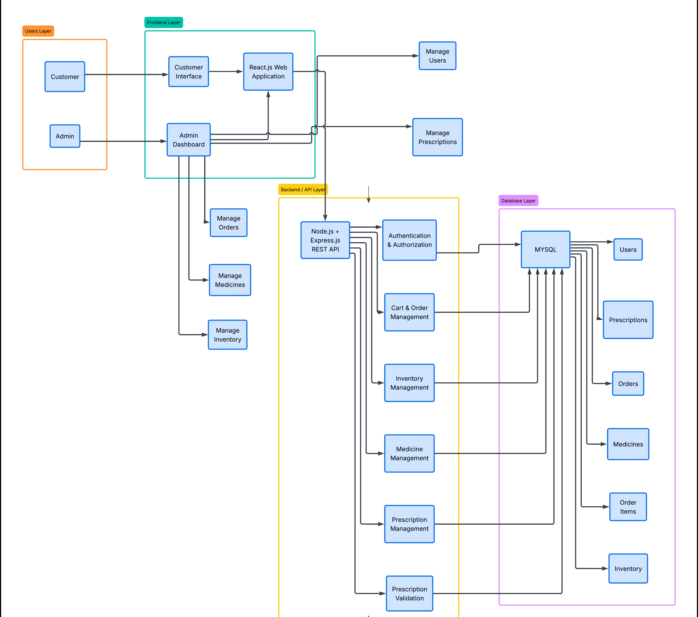

# 💊 Pharmacy E-Commerce with Prescription Validation

Pharmacy E-Commerce with Prescription Validation is a full-stack web application designed to provide a secure and convenient platform for purchasing medicines online. The system allows customers to browse, search, add medicines to their cart, and place orders.

Over-the-counter medicines can be purchased directly, while prescription-only medicines require a valid prescription for pharmacist verification. The system uses a centralized MySQL database to manage customers, medicines, inventory, prescriptions, orders, payments, and order status.

---

## 🎯 Problem Statement

With the rapid growth of online healthcare services, purchasing medicines through e-commerce platforms has become increasingly common. However, many existing systems lack a secure mechanism to verify prescriptions before selling prescription-only medicines.

Manual prescription verification can also be slow and inconvenient for both customers and pharmacists. Therefore, there is a need for a secure and integrated pharmacy e-commerce system that supports prescription validation, safe medicine dispensing, efficient order management, and proper record management.

---

## 🔄 Existing vs Proposed System

### Existing System

- Traditional online pharmacies mainly focus on medicine browsing and e-commerce.
- Customers can search for medicines, add products to a cart, and place orders.
- Prescription medicines generally require manual prescription submission and verification.
- Inventory, customer, prescription, and order records may be managed separately.
- Limited integration between prescription verification and order processing can make the process slower.
- There is a need for better integration between prescription verification and medicine ordering.

### Proposed System

- Provides a complete online pharmacy e-commerce platform.
- Customers can browse, search, and order medicines online.
- Prescription-only medicines require prescription upload before purchase.
- Pharmacists can review and validate submitted prescriptions.
- Approved prescriptions allow the corresponding order to proceed.
- MySQL centrally manages customers, medicines, prescriptions, orders, payments, and inventory.
- Provides separate access for Customers, Pharmacists, and Administrators.
- Uses authentication and APIs for secure and efficient operations.

---

## 🏗️ System Architecture

The system follows a layered architecture consisting of the Users Layer, Frontend Layer, Backend/API Layer, and Database Layer.

### Architecture Layers

**Users Layer**
- Customer
- Admin

**Frontend Layer**
- Customer Interface
- Admin Dashboard
- React.js Web Application

**Backend / API Layer**
- Node.js + Express.js REST API
- Authentication & Authorization
- Medicine Management
- Prescription Management
- Prescription Validation
- Cart & Order Management
- Inventory Management

**Database Layer**
- MySQL Database
- Users
- Medicines
- Prescriptions
- Orders
- Order Items
- Inventory

### Architecture Diagram

<p align="center">
  
</p>

---

## 🔁 System Workflow

The main workflow of the system is:

1. Customer browses available medicines.
2. Customer adds medicines to the cart.
3. Customer proceeds to checkout.
4. The system checks whether a prescription is required.
5. If required, the customer uploads a prescription.
6. The prescription is sent for validation.
7. If the prescription is approved, the order proceeds.
8. The order is confirmed.
9. Inventory is updated.
10. If the prescription is rejected, the order is not processed.

### Prescription Validation Flow

```text
Customer
   ↓
Browse Medicines
   ↓
Add to Cart
   ↓
Checkout
   ↓
Check Prescription Requirement
   ↓
Upload Prescription
   ↓
Prescription Validation
   ↓
 ┌───────────────┐
 │   Validation  │
 └───────┬───────┘
         │
    ┌────┴────┐
    ↓         ↓
 Approved   Rejected
    ↓         ↓
 Order      Order Not
Confirmation  Processed
    ↓
Inventory Update
